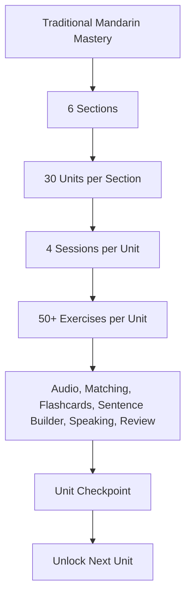

# Learning Mode Course Structure

Status: active with deterministic vocabulary seeding and runtime unit teaching payloads.

This document defines the Duolingo-style Learning Mode architecture. It is intentionally a structure contract only. Lesson content should be added later through `learning_mode_course_structure.json` without changing the app flow.

## Course Diagram

## Section Progression

| Section | Level | Unit Count | Goal |
| --- | --- | ---: | --- |
| 1 | Novice | 30 | Sounds, greetings, core people words, simple sentence habits |
| 2 | Pre-A1 | 30 | Daily routines, food, shopping, directions, basic conversations |
| 3 | A1 | 30 | Travel, health, work, plans, opinions, basic social life |
| 4 | Pre-A2 | 30 | Longer conversations, explanations, simple narratives |
| 5 | A2 | 30 | Practical independence, richer grammar, real-world tasks |
| 6 | B1 Bridge | 30 | Exam bridge, discussion, summaries, comparisons, longer listening |

## Unit Contract

Each unit must contain:

- `unit_id`
- `title`
- `focus`
- `can_do`
- `grammar_targets`
- `vocabulary_targets`
- `audio_targets`
- `sessions`

Each unit must have exactly 4 sessions:

1. `learn` introduces the vocabulary and sound pattern.
2. `build` converts words into short sentences.
3. `listen` checks audio recognition and dictation.
4. `review` mixes old and new material, then checkpoints the unit.

Each unit should target at least 10 vocabulary items and at least 50 generated exercise prompts when the content payload is added.

## Session Flow

## Runtime Teaching Payload

Each unit now receives a deterministic teaching payload at runtime:

- can-do goal
- grammar micro-lesson
- mini dialogue
- listening mission
- reading prompt
- speaking prompt
- writing prompt

This keeps the 180-unit course maintainable while avoiding random generation inside the app.

## Exercise Types

The JSON structure currently defines these exercise contracts:

- `new_word_card`
- `pinyin_choice`
- `meaning_choice`
- `flash_choice`
- `matching_pairs`
- `sentence_builder_zh`
- `sentence_builder_en`
- `listen_choose_meaning`
- `listen_choose_pinyin`
- `dictation_tiles`
- `speaking_repeat`
- `roleplay_prompt`
- `unit_checkpoint`

## Content Rules

- No random AI generation inside the app.
- Use Traditional Chinese first.
- Pinyin must be optional and hideable.
- Human pinyin audio is preferred when available.
- TTS is allowed only as fallback for missing local audio.
- Early units must not introduce advanced A2/B1 grammar.
- Each exercise must include enough metadata for feedback, not only correct/incorrect.

## UI Rules For The Next Phase

- Lesson screens must fit iPhone 15 Pro height without the action button hiding behind the bottom nav.
- The Learning Mode map may scroll vertically, but active lesson screens should not require scrolling.
- Bottom navigation safe-area spacing must be reserved globally.
- Every exercise screen must have one primary action area at the bottom.
- Feedback panels must be state-specific: learned new word, correct, wrong, listen again, speaking timeout, checkpoint complete.

## Implementation Phases

### Phase 1: Structure

Done. Defines sections, units, session template, exercise contracts, and progression rules.

### Phase 2: Content Payloads

Fill Section 1 first:

- 30 novice units
- 10 vocabulary targets per unit
- sentence examples in both directions
- pinyin and audio keys
- matching pairs
- speaking prompts

Then repeat for Sections 2-6.

### Phase 3: Engine Integration

Make Learning Mode read the JSON structure instead of hardcoded unit arrays.

Required behavior:

- section selector reads all 6 sections
- unit map reads all 180 units
- session launcher reads the selected unit/session
- lesson generator builds exercises from content payloads
- progress storage tracks section, unit, session, hearts, XP, streak, and completed exercises

### Phase 4: Audio And Speaking

Wire all exercise audio to:

1. local human audio when available
2. Chinese TTS fallback
3. visible timeout and skip path for speaking/listening failures

### Phase 5: QA

Validate:

- all sections have 30 units
- every unit has 4 sessions
- every unit has 10+ vocabulary targets
- every unit can produce 50+ exercises
- every answer set contains the correct option
- no lesson screen scrolls under the nav on iPhone 15 Pro
- dark and light themes both pass contrast checks
